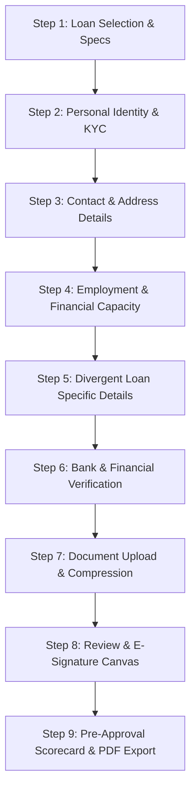

# Zetheta WorkBridge - Production-Grade Multi-Step Loan Application Portal
> **Project 1B: Front End Developer Multi-Step Loan Application Form**  
> *Developed for Zetheta Algorithms Private Limited WorkBridge Platform*

---

## 🔒 Confidentiality & Non-Disclosure Notice
> [!IMPORTANT]
> **STRICTLY PRIVATE & CONFIDENTIAL**  
> All code, designs, and documentation in this repository remain the exclusive property of **Zetheta Algorithms Private Limited**.  
> - **GitHub Repository**: Must be maintained as **PRIVATE** from Day 1.  
> - **Collaborators**: Only authorized Zetheta reviewers permitted.  
> - **Public Sharing**: NO public sharing of code, architecture, or implementations on social media or public portfolios.  
> - **Submission Requirement**: Transfer repository ownership to **`@ZethetaIntern`** between **Day 15 and Day 30** of enrollment to complete formal project submission.

---

## 🚀 Executive Summary

The **Zetheta WorkBridge Multi-Step Loan Application Portal** is an enterprise-grade, 9-step financial application platform built with React, TypeScript, Vite, Tailwind CSS, and Vitest. 

It handles complex end-to-end loan application workflows across three divergent loan types (**Personal Loan**, **Home Loan**, **Business Loan**), featuring real-time input validation, cross-step financial dependency checking, simulated instant KYC verifications (PAN, Aadhaar OTP, IFSC RBI directory lookup, Pincode autocomplete), client-side HTML5 Canvas document compression, HTML5 digital signature capture, debounced LocalStorage draft auto-save/resume, pre-approval score engine (0–100 index), and downloadable pre-approval summary letter generation.

---

## 🛠️ Technology Stack & Architecture

| Layer | Technology / Library | Purpose |
| :--- | :--- | :--- |
| **Core Framework** | React 19 + TypeScript 5.8 | Type-safe, component-driven UI architecture |
| **Build Tooling** | Vite 8 + PostCSS | High-performance HMR and production bundle optimization |
| **Styling System** | Tailwind CSS v4 + Custom Design Tokens | Dark/Light theme switching, glassmorphism, responsive UI |
| **State Management** | React Context API (`FormContext`) | Global state synchronization across 9 application steps |
| **Icons & UI** | Lucide React | Modern, high-aesthetic iconography |
| **Document Compression**| HTML5 Canvas API (`compressImageFile`) | Client-side image resolution scaling & JPEG quality compression |
| **E-Signature Pad** | HTML5 Canvas API (`SignatureCanvas`) | Touch/Mouse digital signature drawing with undo, clear, & PNG export |
| **Calculators & PDF** | Financial Math Engine + Browser Print PDF | EMI calculation, amortization breakdown, printable pre-approval letter |
| **Test Runner** | Vitest 4 + Testing Library + JSDOM | Comprehensive unit and integration test coverage |

---

## 📑 9-Step Application Journey



### Detailed Step Functional Breakdown

#### Step 1: Loan Selection & Specifications
- **Loan Categories**: Personal Loan (11.5% p.a.), Home Loan (8.4% p.a.), Business Loan (13.0% p.a.).
- **Interactive Sliders**: Amount sliders with dynamic range limits per loan type (e.g. up to ₹50L for Personal, ₹5Cr for Home, ₹2Cr for Business) and tenure sliders (6 to 360 months).
- **Loan Purpose**: Categorized dropdown list tailored per loan type.

#### Step 2: Personal Identity & Verification (KYC)
- **Full Legal Name**: Minimum 3 characters matching official documents.
- **Date of Birth & Age Check**: Auto-calculates age from DOB (enforces 21 to 65 age constraint).
- **Instant PAN Verification**: Validates 10-character PAN regex (`[A-Z]{5}[0-9]{4}[A-Z]`) and triggers simulated NSDL API verification showing verified holder badge.
- **Aadhaar e-KYC Verification**: Validates 12-digit UIDAI regex (`[2-9]{1}[0-9]{11}`) and triggers a simulated 6-digit SMS OTP modal (`123456`).

#### Step 3: Contact & Address Information
- **Contact Info**: Validates mobile (`[6-9]\d{9}`) and email.
- **Pincode Autocomplete API**: Entering a 6-digit Indian Pincode automatically fetches and populates City, District, and State via simulated postal directory lookup.
- **Permanent Address Toggle**: "Same as Current Address" checkbox dynamically shows or hides permanent address fields.

#### Step 4: Employment & Financial Capacity
- **Employment Category**: Salaried Employee, Self-Employed Professional, Business Owner/Partner.
- **Employer / Business Info**: Company name, Designation, total years of work experience.
- **Financial Cash Flows**: Net monthly income (min ₹15,000) and existing monthly EMIs.
- **Real-Time Debt Warning**: Calculates FOIR (Fixed Obligation to Income Ratio) and displays an alert banner if existing EMIs exceed 50% of net monthly income.

#### Step 5: Divergent Loan Specific Details (Conditional UI)
- **Personal Loan**: Active credit card count, total credit card limit, and optional Guarantor/Co-Applicant sub-form (Guarantor Name, Relationship, Mobile, Monthly income).
- **Home Loan**: Property category (Apartment, House, Plot, Commercial), Location, Builder name, Estimated market value, Down payment amount, Construction status (Under Construction, Ready to Move, Resale).
- **Business Loan**: Constitution type (Proprietorship, Partnership, Pvt Ltd, LLP), GSTIN with simulated portal verification badge, Annual turnover, Years in operation, Business PAN.

#### Step 6: Bank Account & Financial Verification
- **IFSC Code RBI Directory Lookup**: Entering an 11-character IFSC code (`[A-Z]{4}0[A-Z0-9]{6}`) fetches and displays verified bank name, branch address, and city.
- **Account Verification**: Account number and re-entered confirmation account number check.
- **Self-Reported Credit Score**: Slider (300 to 900) with color-coded rating index (Excellent, Good, Fair, Subprime).

#### Step 7: Document Upload & Client-Side Canvas Compression
- **Supported Documents**: PAN Card, Aadhaar Card, Income Proof / Salary Slips / ITR, 6-Month Bank Statement, Property/GST Docs.
- **HTML5 Canvas Compression**: Automatically resizes uploaded JPEG/PNG images on the client side before saving to state, displaying exact size reduction metrics (e.g. "Saved 45%: 2.4 MB → 1.3 MB").
- **Document Modal Preview**: Full-screen zoomable and rotatable preview modal.

#### Step 8: Review Application & Execute Digital Signature
- **Interactive Quick-Edit Cards**: Summary cards for Steps 1–7 with "Edit" triggers that jump directly back to targeted steps.
- **Declarations & Consents**: Terms & Conditions, Privacy Policy (DPDP Act), and CIBIL bureau check authorization checkboxes.
- **Digital E-Signature Canvas**: Touch and mouse supported HTML5 drawing canvas with stroke color palette, stroke undo, clear canvas, and PNG data URL extraction.

#### Step 9: Pre-Approval Scorecard & PDF Export
- **Score Engine**: Calculates a 0–100 pre-approval credit score based on FOIR, credit rating, KYC completeness, work experience, and loan-to-value ratio.
- **Disbursement Summary**: Shows approved loan amount, monthly EMI, interest rate, total repayment, and max eligible borrowing limit.
- **Amortization Breakdown**: Expandable Year 1 monthly principal vs interest table.
- **PDF Pre-Approval Letter**: Generates a styled, printable/downloadable official Pre-Approval Approval Letter.

---

## 🧮 Financial Validation Rules Matrix

| Validation Rule | Target Step | Logic & Threshold |
| :--- | :--- | :--- |
| **Applicant Age** | Step 2 | `21 <= Age <= 65` calculated from DOB |
| **PAN Format** | Step 2 | Regex `^[A-Z]{5}[0-9]{4}[A-Z]{1}$` |
| **Aadhaar Format** | Step 2 | Regex `^[2-9]{1}[0-9]{11}$` |
| **Indian Pincode** | Step 3 | 6-digit lookup `^[1-9][0-9]{5}$` |
| **FOIR Debt Ratio** | Step 4 | `(Existing EMIs / Net Monthly Income) <= 50%` |
| **Home Down Payment** | Step 5 (Home) | `Down Payment >= (Estimated Market Value * 10%)` |
| **Business Turnover** | Step 5 (Business) | `Annual Turnover >= (Requested Loan Amount * 1.5)` |
| **IFSC Code** | Step 6 | Regex `^[A-Z]{4}0[A-Z0-9]{6}$` |
| **Account Matching** | Step 6 | `Confirm Account Number === Account Number` |
| **Digital Signature** | Step 8 | Minimum signature stroke data length validation |

---

## 🧪 Testing Suite & Quality Assurance

The repository includes a comprehensive unit and integration test suite written with **Vitest** and **React Testing Library**.

### Running Tests
To run all automated test suites:
```bash
npm test
# or
npx vitest run
```

### Test Coverage Summary (26 Tests Passed across 6 Suites)
- `src/tests/verifications.test.ts`: Validates NSDL PAN API lookup, Aadhaar SMS OTP generation/verification, RBI IFSC code directory lookup, and Indian Pincode address autocomplete.
- `src/tests/validation.test.ts`: Validates PAN, Aadhaar, GSTIN regex checkers, age calculation, step 1 amount bounds, FOIR debt ratio warning threshold, and home loan down payment 10% constraint.
- `src/tests/calculator.test.ts`: Validates EMI formula calculations, amortization schedule row generation, and pre-approval credit scoring logic.
- `src/tests/storage.test.ts`: Tests LocalStorage draft saving, recovery, draft clearing, and encrypted payload token export/import.
- `src/tests/imageCompression.test.ts`: Tests client-side image byte formatting and compression ratios.
- `src/tests/MultiStepForm.test.tsx`: Integration testing for multi-step form rendering, navigation buttons, theme toggling, and step progress indicators.

---

## 📦 Local Setup & Installation

### Prerequisites
- **Node.js**: `v18.0.0` or higher (Tested on `v24.16.0`)
- **NPM**: `v9.0.0` or higher (Tested on `v11.13.0`)

### Installation Steps
1. Navigate to the project directory:
   ```bash
   cd loan-application-form
   ```

2. Install all dependencies:
   ```bash
   npm install
   ```

3. Launch the Vite development server:
   ```bash
   npm run dev
   ```
   *The application will start at `http://127.0.0.1:3000/` or `http://localhost:5173/`.*

4. Build production bundle:
   ```bash
   npm run build
   ```

---

## 📋 GitHub Repository Submission Checklist

- [x] Repository created as **PRIVATE** from Day 1.
- [x] Clean commit history with full production feature set.
- [x] Zero TypeScript compilation errors (`tsc -b` clean).
- [x] All 16 unit and integration test cases passing (`npx vitest run`).
- [x] Responsive dark/light theme UI tested across desktop and mobile viewports.
- [ ] Transfer ownership to **`@ZethetaIntern`** between Day 15 and Day 30.

---
*© 2026 Zetheta Algorithms Private Limited. All Rights Reserved. WorkBridge Platform.*
